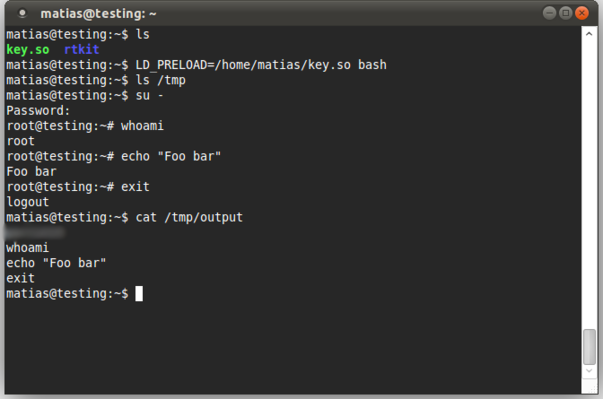
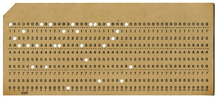
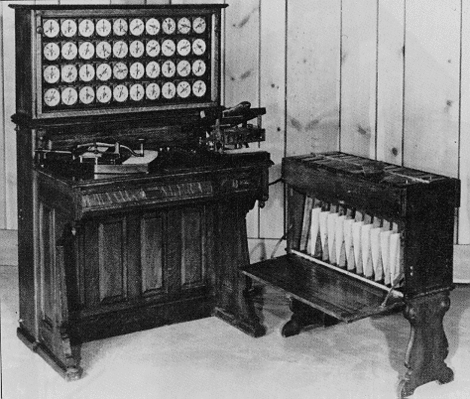
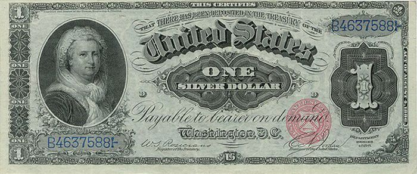

class: center, middle
# Scripting 2

TSBE Frühlingssemester 2016  
`http://smlz.github.io/tsbe-2016fs/scri/`  

Marco Schmalz  
`marco.schmalz@gibb.ch`  
  
.footnote.bottom[<a rel="license" href="http://creativecommons.org/licenses/by-sa/4.0/"></a>]

---
## Kursübersicht

1. Bash und UNIX-Tools

2. **Einführung in Python**

3. Python: Datei und Prozessoperationen

4. TBA

5. Repetition
---
# Heute

1. Repetition Bash

2. Python
---

# Eine kleine Geschichte

.center[]

---
# Terminal 80x24

.center[]


---
# VT100

.center[]

---
# Lochkarte

.center[]

---
# Volkszählung USA 1890

.center[]
---
# Dollarnote

.center[]

---
# Repetitionsübung Bash

```bash
#!/bin/bash
echo -n "Zahl 1: "
read n1
echo -n "Zahl 2: "
read n2
echo -n "Zahl 3: "
read n3

if [ $n1 -eq $n2 ] && [ $n1 -eq $n3 ] && [ $n2 -eq $n3 ]
then
     echo "=="
     echo "$n1"    
elif [ $n1 -ge $n2 ] && [ $n1 -ge $n3 ]
then
	echo "$n1"
elif [ $n2 -ge $n1 ] && [ $n2 -ge $n3 ]         
then
	echo "$n2"
elif [ $n3 -ge $n1 ] && [ $n3 -ge $n2 ]         
then
     echo "$n3"
else
echo "??"    
fi
```
---
# Übung 2

Ein Aufruf eines Skriptes mit dem Namen add.sh sieht zum Beispiel so aus:

```
$ ./add.sh
Bitte erste Zahl angeben: 15
Bitte zweite Zahl angeben: 12 
Die Summe von 15 und 12 ist 27.
```
Schreiben sie in der Folge ein Bash-Skript, welches zwei ganze Zahlen addiert.

---
# Zusatzbedingung

Zusatzbedingung: Falls das Resultat der Addition 42 beträgt, soll das Programm anstelle der Summe der beiden Zahlen, folgenden Text ausgeben: 
```
die Antwort nach dem Leben, dem Universum und dem ganzen Rest.
```
