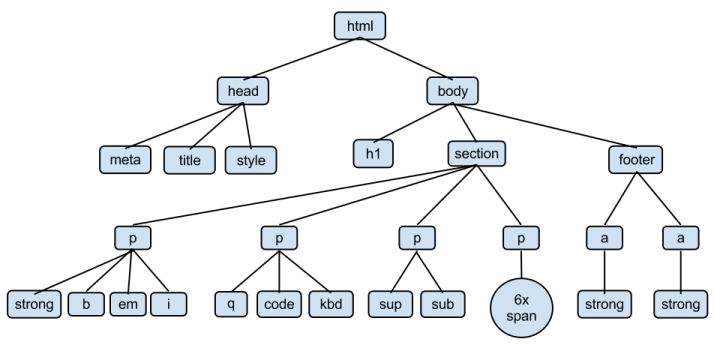
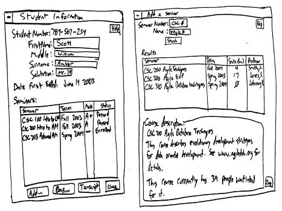

class: center, middle
# Web-Programmieren 1

TSBE Frühlingssemester 2018  
`http://smlz.github.io/tsbe-2018fs/web/`  

Marco Schmalz  
`marco.schmalz@gibb.ch`  

.footnote.bottom[<a rel="license" href="http://creativecommons.org/licenses/by-sa/4.0/"></a>]
---
# Kursübersicht

1. **Einführung, HTML, UX-Desing, Projektstart**

2. CSS, CSS-Frameworks, Einführung JavaScript

3. JavaScript, MVVM-Framework (vue.js), Projektarbeit

4. Routing, einfaches Backend, Projektarbeit

5. Build-Tools, Präsentationen, Praxistipps

---
# Heute

1. Einführung

2. Gruppenarbeit zu HTML-Tags

3. Informationen zum Projekt

   _Pause_ ☕

4. UX-Workshop
  * Warum UX
  * Checkliste für gutes Design
  * Research-Phase
  * Design-Studio Gruppenarbeit

   _Pause_ ☕

5. Story-Boards zeichnen

6. Projektarbeit

---
class: center
# HTML als Baumstruktur



---
# Ressourcen zu HTML

* Mozilla Developer Network: https://developer.mozilla.org/

  Bei Google *MDN* zum Suchbegriff eingeben.

* SelfHTML Wiki (Deutsch): https://wiki.selfhtml.org/

---

# Gruppenarbeit: HTML-Tags

* 4 Gruppen

* Grundstruktur einer Webseite

* Links

* Bilder einbetten

* Listen und Tabellen

---
## Minimales HTML-Dokument

```html
<!DOCTYPE html>
<html lang="en">
  <head>
    <meta charset="utf-8">
    <title>Seitentitle</title>
  </head>
  <body>
    <!-- Seiteninhalt -->
  </body>
</html>
```

Dokumente überprüfen mit dem HTML Validator: https://validator.w3.org/
---
class: center, middle
#Wettbewerb:<br/> 90er-Jahre Webseite
---
# Tim Berners-Lee

.middle.center[]

.center[Das World Wide Web wurde 1989 in der Schweiz am CERN erfunden.]
---
# Projekt

* 2er- oder 3er-Teams

* Idee erarbeiten: Zum Beispiel Wettplattform

* Beispiele

  * [Zum Runden Leder](http://blog.derbund.ch/zumrundenleder/blog/2014/06/23/115357/)

  * http://www.kicktipp.de/zrl14-15/tabellen

---
# Anforderungen: Job Stories

* **Wenn** SITUATIONSBESCHRIEB,
* **möchte ich** MOTIVATION,
* **damit** ERGEBNIS.

Beispiel:
```
Wenn der Beutel meines Roboterstaubsauger fast (also ca. 90%) voll ist,
möchte ich eine Mitteilung auf das Handy kriegen,
damit ich rechtzeitig neue Säcke kaufen kann.
```

* **Auftrag**:
 * Zweierteams bilden
 * Sich für eine Projektvariante entscheiden
 * Zusammen vier Job-Stories schreiben

* Zusatzinfos: [Replacing The User Story With The Job Story](https://medium.com/the-job-to-be-done/replacing-the-user-story-with-the-job-story-af7cdee10c27)

---
# Screen Designs ...

.center[]

---
# ... auf Papier


** Auftrag **

* Diskutiert, wie ihr eure Applikation in maximal 3 Screens unterbringt

* Zeichnet die Screens auf Papier und spielt die Anwendung durch

* Umsetzung ...
