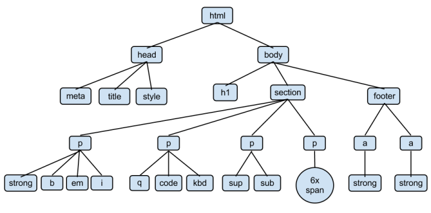
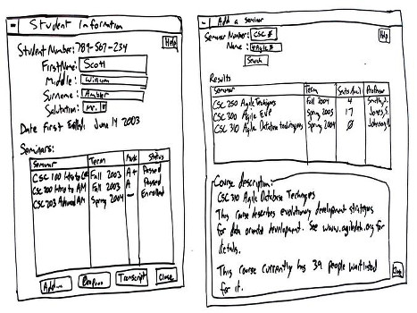

class: center, middle
# Web-Programmieren 1

TSBE Frühlingssemester 2019  
`http://smlz.github.io/tsbe-2019fs/web/`  

Pawel Kowalski
`pawel.kowalski@orbit7.ch`

.footnote.bottom[<a rel="license" href="http://creativecommons.org/licenses/by-sa/4.0/"></a>]
---
# Kursübersicht

1. **Einführung, HTML, UX-Desing, Projektstart**

2. CSS, CSS-Frameworks, Einführung JavaScript

3. JavaScript, MVVM-Framework (vue.js), Projektarbeit

4. Routing, einfaches Backend, Projektarbeit

5. Build-Tools, Präsentationen, Praxistipps

---
# Heute

1. Einführung

2. Gruppenarbeit zu HTML-Tags

3. Informationen zum Projekt

   _Pause_ ☕

4. UX-Workshop
  * Warum UX?
  * Checkliste für gutes Design
  * Research-Phase
  * Design-Studio Gruppenarbeit

   _Pause_ ☕

5. Story-Boards zeichnen

6. Projektarbeit

---
class: center
# HTML als Baumstruktur (1)



---
# HTML als Baumstruktur (2)
```html
<html>
  <head>
    <title>Wilkommen</title>
  </head>
  <body>
    <h1>Guten Tag</h1>
    <a href="https://bademeister.com">Es gibt nur einen Gott</a>
  </body>
</html>
```

* Ein HTML-Element besteht aus einem Anfangs- (z.Bsp. `<strong>`) und einem End-Tag (`</strong>`)

* Zwischen Anfangs- und End-Tag sind freier Text, aber auch weitere HTML-Tags erlaubt.

* HTML-Tags können zusätzlich mehrere Attribute (Key-Value-Paare) enthalten. Zum Beispiel: `class="danger"`

* Einige Tags haben keinen Inhalt. `<hr/>`: Horizontale Linie, `<br/>`: Zeilenumbruch
---
# Ressourcen zu HTML

* Mozilla Developer Network: https://developer.mozilla.org/

  Bei Google *MDN* zum Suchbegriff eingeben.

* SelfHTML Wiki (Deutsch): https://wiki.selfhtml.org/

---

# Gruppenarbeit: HTML-Tags

* 4 Gruppen

* Grundstruktur einer Webseite

* Links

* Bilder einbetten

* Listen und Tabellen

---
## Minimales HTML-Dokument

```html
<!DOCTYPE html>
<html lang="en">
  <head>
    <meta charset="utf-8">
    <title>Seitentitle</title>
  </head>
  <body>
    <!-- Seiteninhalt -->
  </body>
</html>
```

Dokumente überprüfen mit dem HTML Validator: https://validator.w3.org/
---
class: center, middle
#Wettbewerb:<br/> 90er-Jahre Webseite
---
# Tim Berners-Lee

.middle.center[]

.center[Das World Wide Web wurde 1989 in der Schweiz am CERN erfunden.]
---
# Projekt

* 2er- oder 3er-Teams

* Projekt-Idee erarbeiten
  * Real-Time-Chat
  * Voting-App
  * Aquarium-Steuerung
  * Tipp-Spiel
  * ...

* Im Web nach Inspirationen Suchen
  * Emojis wie bei GitHub
  * Suchvorschläge wie bei search.ch
  * ...

* Technische Spielwiese aussuchen
  * ELM
  * WebGL
  * ...
  
---
# Screen Designs ...

.center[]

---
# ... auf Papier


** Auftrag **

* Diskutiert, wie ihr eure Applikation in maximal 3 Screens unterbringt

* Zeichnet die Screens auf Papier und spielt die Anwendung durch

* Umsetzung ...

---
# Anforderungen: Job Stories

* **Wenn** SITUATIONSBESCHRIEB,
* **möchte ich** MOTIVATION,
* **damit** ERGEBNIS.

Beispiel:
```
Wenn der Beutel meines Roboterstaubsauger fast (also ca. 90%) voll ist,
möchte ich eine Mitteilung auf das Handy kriegen,
damit ich rechtzeitig neue Säcke kaufen kann.
```

* **Auftrag**:
 * Zweierteams bilden
 * Sich für eine Projektvariante entscheiden
 * Zusammen vier Job-Stories schreiben

* Zusatzinfos: [Replacing The User Story With The Job Story](https://medium.com/the-job-to-be-done/replacing-the-user-story-with-the-job-story-af7cdee10c27)

